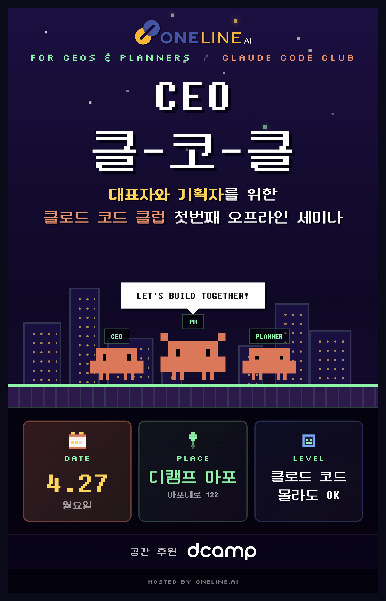

# CEO 클-코-클 (Claude Code Club) 1st Meetup

  

대표자와 기획자를 위한 **클로드 코드 클럽** 첫 번째 오프라인 세미나

## 행사 정보

- **일시**: 2026년 4월 27일 (월) 오후 7:00 ~ 8:30
- **장소**: 디캠프 마포 4F 세미나실B
- **참가비**: 무료
- **주최**: 원라인에이아이 (OnelineAI)
- **공간 후원**: d·camp

## Time Table

| 시간 | 세션 | 연사 |
|---|---|---|
| 19:00 – 19:10 | 오프닝 및 행사 소개 | — |
| 19:10 – 19:30 | Paradigm Shift — 100만개 문서를 처리하는 100만개 솔루션 개발하기 | 정한얼, 원라인에이아이 CEO |
| 19:30 – 20:00 | Second Wave — 지식 저장소와 하네스 엔지니어링 | 전현준, 원라인에이아이 CTO |
| 20:00 – 20:30 | Real Impact — 실제 사례 공유 | (연사 미정) |
| 20:30 ~ | Beer Night~! | — |

## 발표 자료

이 레포지토리에는 CEO 클-코-클 1차 밋업의 **발표 자료 및 참고 문서**가 업로드됩니다.

## 문의

earl@onelineai.com
